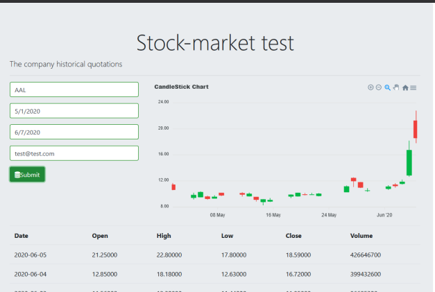

Test project  
==================
The application provide a web interface for retrieving historical stocks data from financial API.

Installation
==================
As the project is dockerized. Yo need to install [docker](https://www.docker.com/)

- Download project from repository
```bash
git clone git@github.com:SergeyKoz/stock-market.git
```

Configuration

Config file `config/services.yaml`

```yaml
parameters:
    financial_api_key: '<the api key>'
    financial_api_url: 'https://apidojo-yahoo-finance-v1.p.rapidapi.com'
```

Config file `.env`

```yaml
APP_SECRET=<APP SECRET>
```

- Run containers 
```bash
docker-compose up
docker exec stock-market-php /bin/sh -lc "composer install"
```
- Load initial database 
```bash
docker exec stock-market-php /bin/sh -lc "php bin/console doctrine:migrations:migrate"
docker exec stock-market-php /bin/sh -lc "php bin/console doctrine:fixtures:load"
```

- Init frontend part (Angular) 
```bash
docker exec stock-market-angular /bin/sh -lc "npm install -g > /dev/null && npm run build"
```

The application is allowed by address [http://127.0.0.1:80](http://127.0.0.1:80/)
The api is allowed by address [http://127.0.0.1:80/api/stocks/historical-data/](http://127.0.0.1:80/api/stocks/historical-data/)



